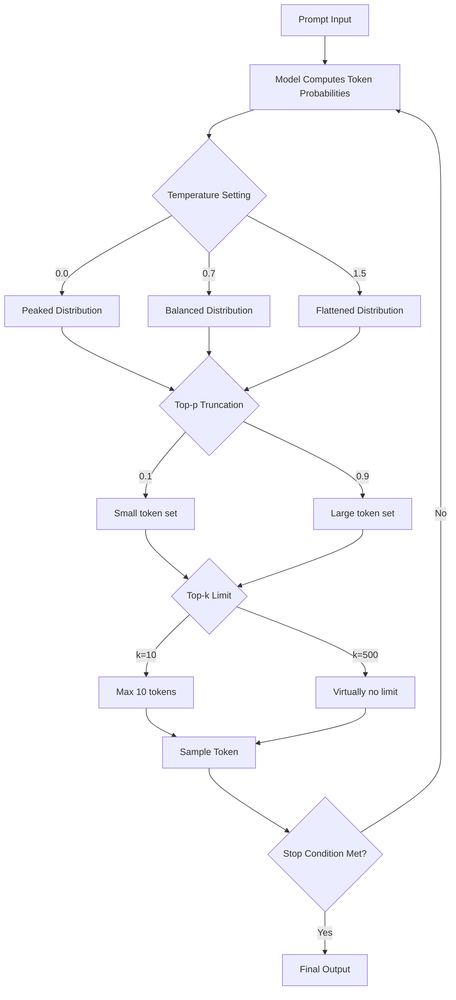

# Module 1: Foundations of Generative AI & Prompting

**Understand how LLMs generate text and how configuration parameters shape their output — the mechanical foundation every prompt engineer needs.**

---

## Why This Matters for an AI Engineer 🟢

Prompt engineering without understanding the generation pipeline is like tuning a car engine by ear. You might get lucky, but you cannot diagnose failures or optimize reliably. Every downstream technique — Chain of Thought, few-shot, RAG — produces output through the same token-by-token sampling process with the same parameters. If you do not understand what `temperature` and `top_p` actually control at the probability distribution level, you cannot reason about why a prompt fails, why a model "hallucinates," or why changing a parameter fixes one problem while creating another.

In production, this knowledge directly impacts **cost** (longer max_tokens = higher per-request cost), **latency** (streaming behavior depends on sampling strategy), and **correctness** (deterministic tasks need temperature=0, creative tasks need higher values). Getting the foundations wrong means debugging downstream failures that are actually upstream configuration problems.

---

## 1. How LLMs Generate Text 🟢

A large language model is a neural network trained to predict the next token in a sequence. Given a prompt like `"The capital of France is"`, the model computes a probability distribution over its entire vocabulary for what token comes next. The token `"Paris"` might have probability 0.92, `"Lyon"` 0.03, `"the"` 0.01, and so on for every token in the vocabulary.

Generation proceeds token-by-token:

1. The model receives your prompt and computes a probability distribution over all possible next tokens.
2. A token is **sampled** from that distribution according to your configuration parameters.
3. The sampled token is appended to the sequence, and the model recomputes the distribution for the next position.
4. This repeats until a stop condition is met (end-of-sequence token, max token limit, or manual stop).

The configuration parameters — `temperature`, `top_p`, `top_k`, and `max_tokens` — control **how** tokens are sampled from that distribution. They do not change what the model learned; they change how the model selects from what it knows.

### Tokenization

Models do not operate on raw text. Input is split into **tokens** — subword units that may be parts of words, whole words, or punctuation. The word `"unbelievable"` might tokenize as `["un", "believ", "able"]` (three tokens). This matters because:

- **Token limits are real**: models have a fixed context window (e.g., 128K tokens). A "page" of text is roughly 250-500 tokens depending on content.
- **Cost is token-metered**: API pricing is per-token for both input and output.
- **Model behavior varies by token**: some token boundaries produce unexpected generation patterns.

---

## 2. Configuration Parameters 🟡

### Temperature

Temperature scales the logits (raw scores) before softmax converts them to probabilities. It controls the "shape" of the distribution.

| Temperature | Effect | Use Case |
|-------------|--------|----------|
| 0.0 | Peaked distribution — highest-probability token chosen almost always | Factual Q&A, code generation, classification |
| 0.3 | Slight randomness — mostly deterministic with minor variation | Structured output, data extraction |
| 0.7 | Balanced — moderate randomness | General-purpose对话, content generation |
| 1.0 | Full distribution — matches the model's learned probabilities | Creative writing, brainstorming |
| 1.5-2.0 | Flattened — high-probability and low-probability tokens get closer chances | Highly creative tasks, avoiding repetition |

**Key insight**: Temperature=0 is NOT fully deterministic across API calls. Floating-point non-determinism and parallel processing mean you may get slightly different outputs even at temperature=0. For true reproducibility, you need seed parameters (where supported) and identical input.

**Provider note**: OpenAI supports 0.0-2.0. Anthropic supports 0.0-1.0. Claude 4.7+ reasoning models (o1, o3, etc.) have temperature fixed at 1.0 and cannot be adjusted.

### Top-p (Nucleus Sampling) 🟡

Top-p truncates the vocabulary to the smallest set of tokens whose cumulative probability exceeds the threshold. At top_p=0.9, the model considers only the most probable tokens that together account for 90% of the probability mass.

| Top-p | Effect |
|-------|--------|
| 0.1 | Only the most likely ~10% of probability mass considered |
| 0.5 | Moderate truncation |
| 0.9 | Wide but bounded — ignores tail of very unlikely tokens |
| 1.0 | No truncation — all tokens considered |

**Critical rule**: Adjust EITHER temperature OR top_p, not both simultaneously. Changing both creates unpredictable interactions because you are modifying the distribution shape AND the truncation at the same time.

### Top-k 🟡

Top-k limits consideration to the k most probable tokens regardless of their individual probabilities. At top_k=10, only the 10 most likely tokens are sampled from.

| Top-k | Effect |
|-------|--------|
| 1 | Greedy decoding — always picks the single most likely token |
| 10 | Moderate constraint |
| 50 | Wide selection |
| 500 | Very permissive (effectively disabled for most vocabularies) |

**Provider note**: OpenAI does not expose top-k as a user-facing parameter. Anthropic exposes it (default effective value: 250). Ollama supports it via the options object.

### Max Tokens

Controls the maximum number of tokens the model will generate before stopping. This is a hard limit — the model will not exceed it.

- **OpenAI**: Uses `max_output_tokens` in the Responses API (renamed from `max_tokens` in Chat Completions). Default varies by model.
- **Anthropic**: `max_tokens` is **required** — you must always specify it. No implicit default.
- **Ollama**: `num_predict` in the options object.

Setting this too low truncates responses mid-sentence. Setting it too high wastes tokens (and money) on potentially infinite rambling.

---

## 3. Parameter Interaction Flow

---

## 4. Before/After: The Impact of Parameter Tuning 🟢

### Prompt: "Write a one-sentence product description for a noise-cancelling headphone."

**Before (Temperature 1.5, Top-p 1.0 — unconstrained):**
> "Dive into a symphony of silence where the world's cacophony dissolves like morning mist over a forgotten meadow, leaving only the pure, crystalline notes of your favorite compositions."

This is creative but impractical for a product page — too poetic, too long, not saleable.

**After (Temperature 0.3, Top-p 0.9 — controlled):**
> "Block out background noise and enjoy crystal-clear audio with adaptive noise cancellation that adjusts to your environment."

This is concise, factual, and product-appropriate. Same model, same prompt, different parameters.

**What changed**: Lower temperature concentrated probability mass on the most likely tokens (practical product language). Top-p=0.9 truncated unlikely creative tokens from the tail. The result is a more predictable, commercially useful output.

---

## 5. When to Tune What: Decision Guide 🟡

| Task Type | Temperature | Top-p | Top-k | Why |
|-----------|-------------|-------|-------|-----|
| Code generation | 0.0 | — | — | Deterministic output required |
| Factual Q&A | 0.0-0.3 | 0.9 | — | Accuracy over creativity |
| Classification | 0.0 | — | — | Consistent labels |
| Structured data extraction | 0.0-0.3 | 0.9 | — | Predictable format |
| Content writing | 0.5-0.7 | 0.9 | — | Balanced creativity |
| Brainstorming | 0.7-1.0 | 0.95 | — | Diverse ideas |
| Creative writing | 1.0-1.5 | 1.0 | — | Maximum variety |
| Code review / analysis | 0.3 | 0.9 | — | Precise but not rigid |

---

## 6. Common Pitfalls 🔴

### Pitfall 1: Adjusting Both Temperature and Top-p

This is the most common mistake. Changing both simultaneously creates unpredictable interactions. Temperature reshapes the distribution; top-p truncates it. If you increase temperature (flatten distribution) AND decrease top-p (truncate more aggressively), you get contradictory signals — a wider distribution that is then sharply cut off.

**Fix**: Change one parameter at a time. Start with temperature for coarse control, then use top-p for fine-tuning.

### Pitfall 2: Assuming Temperature=0 Is Deterministic

Even at temperature=0, floating-point non-determinism in GPU parallel processing means you may get slightly different token sequences across calls. For truly reproducible output, use provider-specific seed parameters where available, and always run evaluation over multiple samples.

**Fix**: For critical applications, do not rely on a single call. Run multiple samples and take majority vote or use ensemble methods (covered in Module 3: Self-Consistency).

### Pitfall 3: Setting Max Tokens Too Low

Setting max_tokens too short truncates responses mid-sentence or mid-code-block. This produces broken output that downstream parsers cannot handle. A model generating a JSON response that gets cut at 100 tokens will produce invalid JSON.

**Fix**: For structured output, set max_tokens generously (2000+). Monitor actual usage to optimize downward later. For code generation, 4000+ is typical.

### Pitfall 4: Ignoring Provider Differences

OpenAI's temperature range (0-2) is double Anthropic's (0-1). A temperature of 1.0 on OpenAI is "moderately creative." On Anthropic, temperature=1.0 is "maximum randomness." Code that sets temperature=1.5 across both providers will fail on Anthropic (out of range) or silently behave differently.

**Fix**: Always validate parameter ranges per provider. The `call_llm()` wrapper in this repo normalizes some of this, but you still need to understand the differences for production deployment.

### Pitfall 5: Using High Temperature for Factual Tasks

A temperature of 1.0 on a factual question like "What year was Python released?" might produce "Python was released in 1991" (correct) or "Python was created in 1989 by Guido van Rossum" (conflates release date with first commit date). Higher temperature increases the chance of plausible-sounding but incorrect outputs — the classic hallucination trigger.

**Fix**: Match temperature to task type. Factual tasks: 0.0-0.3. Creative tasks: 0.7+. Never use high temperature when accuracy matters.

---

## 7. Notebooks & Projects

- **Interactive Notebook**: [notebook.ipynb](notebook.ipynb) — Experiment with parameter settings and compare outputs side-by-side
- **Mini-Project**: [mini-project/](mini-project/) — Build a parameter sweep tool that generates comparison tables and visualizations

---

## Key Takeaways

1. LLMs generate text token-by-token by sampling from probability distributions.
2. **Temperature** reshapes the distribution (peaked vs. flat). **Top-p** truncates it. **Top-k** limits the candidate set.
3. Adjust ONE parameter at a time — never both temperature and top-p simultaneously.
4. Match parameter settings to task type: low temperature for accuracy, high for creativity.
5. Provider parameter ranges differ — OpenAI allows 0-2.0, Anthropic allows 0-1.0, reasoning models are locked at 1.0.

---

## Further Reading

- [OpenAI Prompt Engineering Guide](https://developers.openai.com/api/docs/guides/prompt-engineering)
- [Anthropic Claude Prompt Engineering](https://platform.claude.com/docs/en/build-with-claude/prompt-engineering/overview)
- [Anthropic Claude 4 Best Practices](https://platform.claude.com/docs/en/build-with-claude/prompt-engineering/claude-4-best-practices)
