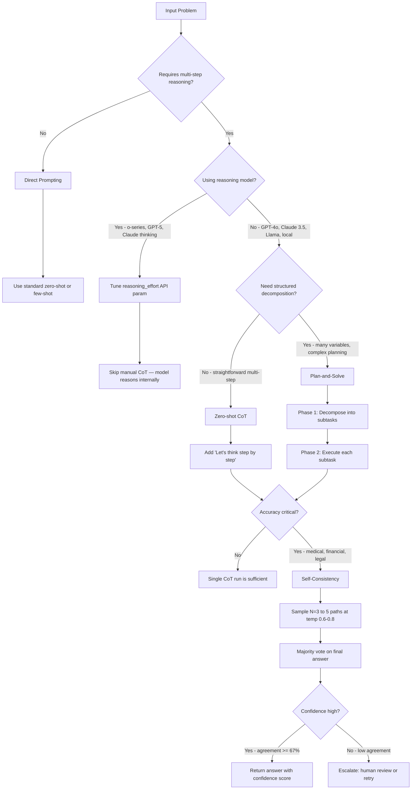

# Module 3: Advanced Reasoning & Logic Techniques

**Teach LLMs to show their work — Chain-of-Thought, Self-Consistency, and Plan-and-Solve transform brittle one-shot answers into reliable multi-step reasoning.**

---

## Why This Matters for an AI Engineer 🟢

A model that jumps from question to answer without showing its reasoning is a black box you cannot debug. When it fails on a multi-step math problem, a logical inference, or a planning task, you have no way to know whether it miscalculated, skipped a step, or misunderstood the problem entirely. Chain-of-Thought (CoT) prompting forces the model to emit intermediate reasoning steps, making failures diagnosable and correctable.

The engineering tradeoffs are real. CoT adds 20–80% latency overhead and multiplies token cost because every reasoning step is output you pay for. Self-Consistency multiplies that cost N times (typically 3–5x) by running multiple samples and voting. Plan-and-Solve adds prompt complexity but can reduce missing-step errors. The question is never "should I always use CoT?" — it is "does this specific task and model combination benefit enough to justify the cost?" For accuracy-critical applications (medical, financial, legal reasoning), the answer is often yes. For simple extraction or classification, it is often no.

A critical 2026 reality: frontier reasoning models (GPT-5, o-series, Claude with extended thinking) perform CoT-like reasoning internally. On those models, manually prompting "think step by step" is redundant and can actively degrade performance. This module teaches you when manual CoT helps (non-reasoning models, local/open-source models, auditable reasoning paths) and when to skip it.

---

## 1. Chain-of-Thought (CoT) Prompting 🟢

Chain-of-Thought prompting instructs the model to generate intermediate reasoning steps before arriving at a final answer. Instead of answering "Roger has 11 tennis balls" directly, the model produces: "Roger started with 5 balls. 2 cans of 3 tennis balls each is 6 tennis balls. 5 + 6 = 11. The answer is 11."

There are two primary variants:

**Zero-shot CoT** appends the trigger phrase "Let's think step by step" to your prompt. Kojima et al. (2022) showed this alone turns a large model into a decent reasoner without any worked examples. It is the cheapest CoT variant — one line, no example curation, quick to test.

**Few-shot CoT** provides 2–3 worked examples that demonstrate the reasoning pattern you want. The examples must show the full reasoning chain, not just the answer. This variant costs more (longer prompts) but gives you control over the reasoning structure and output format.

### When CoT helps vs. backfires

| Scenario | Recommendation |
|---|---|
| Non-reasoning model (GPT-4o, Claude 3.5, Llama 3) | Use zero-shot CoT as baseline |
| Reasoning model (o-series, GPT-5, Claude thinking) | Skip manual CoT; tune `reasoning_effort` instead |
| Multi-step math, logic, planning | CoT provides largest gains |
| Simple extraction, classification, formatting | CoT adds latency without accuracy gain |
| Latency-sensitive real-time path | Avoid — CoT inflates response time |
| Small/local open-source model | CoT helps less (emergent ability requires ~100B+ params) |

### Prompt examples

**Without CoT (direct prompting):**
```
Q: Janet's ducks lay 16 eggs per day. She eats three for breakfast 
every morning and bakes muffins for her friends every day with four. 
She sells the remainder for $2 per egg. How much does she make 
every day?
A: $14
```

**With CoT (zero-shot):**
```
Q: Janet's ducks lay 16 eggs per day. She eats three for breakfast 
every morning and bakes muffins for her friends every day with four. 
She sells the remainder for $2 per egg. How much does she make 
every day?
A: Let's think step by step.
```

The model then generates: "She eats 3 for breakfast, so she has 16 - 3 = 13 left. Then she bakes muffins, so she has 13 - 4 = 9 eggs left. So she has 9 eggs * $2 = $18. The answer is $18."

The direct answer was wrong ($14 vs. the correct $18). CoT surfaced the correct reasoning.

---

## 2. Self-Consistency Prompting 🟡

Self-Consistency (Wang et al., 2022) is CoT's reliability upgrade. Instead of trusting a single reasoning path, you sample multiple independent reasoning chains (typically 3–5) at a non-zero temperature, then take a majority vote on the final answer.

The intuition: a complex reasoning problem typically admits multiple different paths that lead to the same correct answer. If three out of five samples independently arrive at "$18", you have higher confidence than if you trust a single chain. The original paper showed striking improvements: GSM8K +17.9%, SVAMP +11.0%, AQuA +12.2%.

### The three-step process

1. **Prompt** the model with CoT (zero-shot or few-shot)
2. **Sample** N times at temperature 0.6–0.8 to get diverse reasoning paths
3. **Vote** — extract the final answer from each path, take the majority

### Cost and accuracy tradeoff

| Samples (N) | Typical accuracy gain | Latency multiplier | When to use |
|---|---|---|---|
| 1 (baseline CoT) | Baseline | 1x | Default for non-critical tasks |
| 3 | +8–12% over single CoT | 3x | **Production sweet spot** — good accuracy/cost ratio |
| 5 | +12–18% over single CoT | 5x | High-stakes accuracy-critical tasks |
| 10+ | Diminishing returns | 10x+ | Rarely justified — cost exceeds benefit |

**Critical constraint**: Self-consistency only works for tasks with canonical answers (math, classification, factual Q&A). It does not work for free-form text generation — you cannot majority-vote on a paragraph. For open-ended tasks, see Universal Self-Consistency (which uses an LLM to select the most consistent response instead of rule-based voting).

### Temperature matters

Self-consistency requires diverse samples. At temperature 0.0, every sample produces identical output and voting is meaningless. Use temperature 0.6–0.8 for productive diversity. Going above 0.9 introduces too much noise for voting to be reliable.

---

## 3. Consistency Prompting 🟡

Consistency Prompting is the conceptual foundation underlying Self-Consistency. The core idea: if the model gives the same answer across multiple independent runs, you can be more confident in that answer. Consistency serves as a proxy for correctness.

The practical difference from formal Self-Consistency: Consistency Prompting focuses on using consistency as a **signal** (for confidence estimation, escalation, or quality gating) rather than as a **decoding strategy** (majority vote for the final answer).

### Using consistency as a confidence signal

```python
def check_consistency(prompt: str, n_samples: int = 3, provider: str = "openai") -> dict:
    """Check answer consistency across multiple samples."""
    answers = [call_llm(prompt, provider=provider, temperature=0.7) for _ in range(n_samples)]
    most_common = max(set(answers), key=answers.count)
    agreement = answers.count(most_common) / len(answers)
    
    return {
        "answer": most_common,
        "confidence": agreement,
        "consistent": agreement >= 0.67,  # 2/3 agreement threshold
        "samples": answers,
    }
```

When confidence falls below your threshold, you can escalate to a human reviewer, retry with a different prompt, or flag the output for verification. This pattern is common in production pipelines where reliability matters more than throughput.

---

## 4. Plan-and-Solve Prompting 🔴

Plan-and-Solve (Wang et al., 2023) addresses three failure modes that plague zero-shot CoT: calculation errors, missing-step errors, and semantic misunderstanding errors. Rather than asking the model to "think step by step" and hoping it structures its reasoning well, Plan-and-Solve explicitly instructs the model to first create a plan, then execute it.

### The two-phase approach

**Phase 1 — Planning**: The model decomposes the problem into a sequence of subtasks.

**Phase 2 — Execution**: The model carries out each subtask in order, computing intermediate results.

### Base Plan-and-Solve prompt

```
Q: [problem statement]
A: Let's first understand the problem and devise a plan to solve 
the problem. Then, let's carry out the plan and solve the problem 
step by step.
```

### PS+ (enhanced) prompt

PS+ adds three instructions that reduce errors:
1. "Extract relevant variables and their corresponding numerals" — prevents missing information
2. "Calculate intermediate results" — forces explicit computation at each step
3. "Pay attention to calculation and commonsense" — reduces arithmetic errors

```
Q: [problem statement]
A: Let's first understand the problem, extract relevant variables 
and their corresponding numerals, and devise a plan to solve the 
problem. Then, let's carry out the plan, calculate intermediate 
results, and solve the problem step by step. Pay attention to 
calculation and commonsense.
```

### When to use Plan-and-Solve

| Scenario | Use Plan-and-Solve? |
|---|---|
| Multi-step math with many intermediate calculations | Yes — reduces missing-step and calculation errors |
| Complex word problems with multiple variables | Yes — explicit extraction prevents information loss |
| Simple single-step problems | No — unnecessary overhead |
| Tasks requiring structured output format | Yes — plan phase naturally structures the output |
| Already using few-shot CoT with good examples | Probably not — few-shot examples may suffice |

---

## 5. Reasoning Technique Decision Flow



---

## 6. Before/After: CoT vs. Direct Prompting 🟢

### Problem: Multi-step arithmetic reasoning

**Prompt (without CoT):**
```
Q: A juggler has 12 balls. He loses 3 and buys 5 times as many 
as he lost. How many balls does he have now?
A: 
```

**Output (direct):** "He has 24 balls."

This is wrong. The model jumped from the problem to an answer without showing any reasoning. You cannot tell where it went wrong.

**Prompt (with CoT):**
```
Q: A juggler has 12 balls. He loses 3 and buys 5 times as many 
as he lost. How many balls does he have now?
A: Let's think step by step.
```

**Output (CoT):** "He starts with 12 balls. He loses 3, so he has 12 - 3 = 9 balls. He buys 5 times as many as he lost, which is 5 * 3 = 15 balls. So he has 9 + 15 = 24 balls. The answer is 24."

In this case both answers happened to be correct, but the CoT version shows the reasoning chain. If the answer were wrong, you could inspect the chain to find exactly where the model erred. The real value of CoT is not always accuracy improvement — it is **diagnosability**. When a production system produces a wrong answer, a reasoning chain tells you whether the model misunderstood the problem, miscalculated, or made an invalid inference.

---

## 7. Notebooks & Projects

- **Interactive Notebook**: [notebook.ipynb](notebook.ipynb) — Compare direct prompting, CoT, Self-Consistency, and Plan-and-Solve on real problems with actual model output
- **Mini-Project**: [mini-project/](mini-project/) — Math reasoning solver that benchmarks all four techniques and produces an accuracy comparison table

---

## 8. Common Pitfalls 🔴

### Pitfall 1: Using CoT on reasoning models

OpenAI's o-series, GPT-5 reasoning, Claude with extended thinking, and DeepSeek R1 all perform CoT-like reasoning internally. Explicitly prompting "think step by step" on these models is redundant at best. OpenAI's own documentation states: "Asking a reasoning model to reason more may actually hurt the performance." On reasoning models, configure the `reasoning_effort` API parameter instead of writing manual reasoning prompts.

**Fix**: Identify your model class first. If it is a reasoning model, skip manual CoT entirely. If it is a non-reasoning model (GPT-4o, Claude 3.5 Sonnet, Llama 3), CoT remains valuable.

### Pitfall 2: Self-consistency on free-form generation tasks

Self-consistency requires majority voting on final answers. This works for math (answer is a number), classification (answer is a label), and factual Q&A (answer is a short extract). It does not work for summarization, creative writing, or open-ended generation — you cannot majority-vote on a paragraph.

**Fix**: For free-form tasks, use Universal Self-Consistency (concatenate all outputs and ask an LLM to select the most consistent one) or skip voting entirely and use single-pass CoT with quality evaluation instead.

### Pitfall 3: Running self-consistency at temperature 0

Self-consistency requires diverse reasoning paths. At temperature 0.0, every sample is nearly identical, so the "multiple paths" degenerate into the same path repeated N times. The majority vote then reflects no additional information — you paid for N calls but got the same answer each time.

**Fix**: Use temperature 0.6–0.8 for self-consistency sampling. This produces meaningfully different reasoning chains while staying in a range where the model is still coherent.

### Pitfall 4: Assuming CoT helps small models

CoT is an emergent ability — it only produces significant accuracy gains on models above roughly 100 billion parameters. Smaller models (7B, 13B) can generate fluent-looking reasoning chains, but those chains are frequently logically invalid. The model produces confident-sounding nonsense that is harder to debug than a direct wrong answer.

**Fix**: On small models (< 70B parameters), test CoT against direct prompting before adopting it. If accuracy does not improve, the CoT chain is decorative, not functional.

---

## Key Takeaways

1. CoT forces the model to show its reasoning — the primary value is **diagnosability**, not just accuracy.
2. Self-consistency is CoT's reliability layer: sample N paths (3–5), majority vote. **N=3 is the production sweet spot** for most accuracy-critical tasks.
3. Plan-and-Solve addresses CoT's missing-step and calculation errors by explicitly decomposing the problem before solving.
4. On reasoning models (o-series, GPT-5, Claude thinking), skip manual CoT — tune `reasoning_effort` instead.
5. CoT adds 20–80% latency overhead. Measure whether accuracy gains justify cost for your specific task before deploying at scale.

---

## Further Reading

- [Chain-of-Thought Prompting Elicits Reasoning in Large Language Models](https://arxiv.org/abs/2201.11903) — Wei et al. (2022)
- [Self-Consistency Improves Chain of Thought Reasoning in Language Models](https://arxiv.org/abs/2203.11171) — Wang et al. (2022)
- [Plan-and-Solve Prompting: Improving Zero-Shot Chain-of-Thought Reasoning](https://arxiv.org/abs/2305.04091) — Wang et al. (2023)
- [OpenAI Prompt Engineering Guide](https://developers.openai.com/api/docs/guides/prompt-engineering)
- [Anthropic Claude Prompt Engineering](https://platform.claude.com/docs/en/build-with-claude/prompt-engineering/overview)
