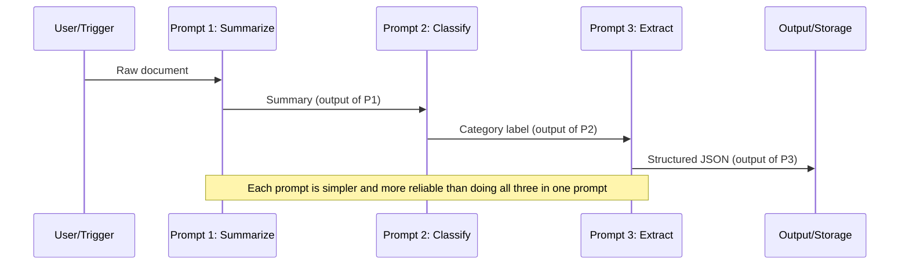
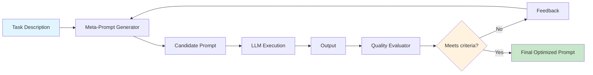
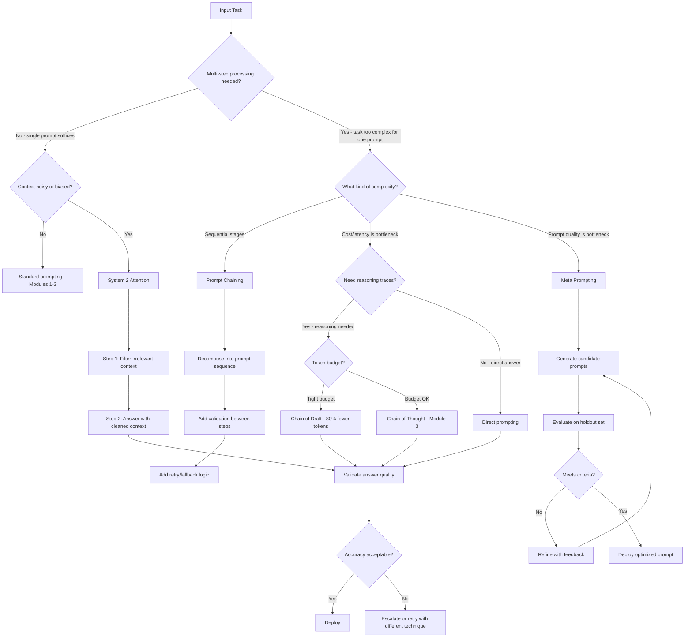

# Module 4: Complex Workflows & System Optimization

**Chain of Draft, System 2 Attention, Prompt Chaining, and Meta Prompting — move beyond single-prompt reasoning into multi-step workflows that think faster, filter noise, and optimize themselves.**

---

## Why This Matters for an AI Engineer 🟢

The techniques in Modules 1–3 are single-prompt strategies: you send one prompt, you get one response. Real production systems rarely work that way. A document processing pipeline chains a summarization prompt into a classification prompt into an extraction prompt. A code review agent generates a review, evaluates its own review for quality, then refines it. A customer support bot filters irrelevant context before answering.

These are **complex workflows** — multi-step prompt pipelines where the output of one prompt becomes the input to another, or where the model itself evaluates and refines its own outputs. The engineering tradeoffs are significant:

- **Chain of Draft (CoD)** cuts token usage by ~80% compared to Chain-of-Thought while matching accuracy — a direct cost and latency win for high-volume production systems (Xu et al., 2025).
- **System 2 Attention (S2A)** adds an extra LLM call to filter irrelevant context, but recovers accuracy that would otherwise be lost to noisy inputs — critical for customer-facing systems where biased or irrelevant context degrades answers.
- **Prompt Chaining** introduces architectural complexity (error propagation, latency accumulation) but enables tasks that no single prompt can solve.
- **Meta Prompting** lets the model write or optimize its own prompts, creating self-improving loops — but you need guardrails to prevent the model from optimizing for the wrong objective.

The question is not whether to use these techniques — it is which ones justify their overhead for your specific pipeline. This module gives you the judgment to decide.

---

## 1. Chain of Draft (CoD) Prompting 🟡

Chain of Draft (Xu et al., 2025) is a token-efficient alternative to Chain-of-Thought. Instead of asking the model to "think step by step" in verbose prose, CoD instructs it to emit **concise, information-dense draft steps** — typically capped at ~5 words per step.

### The intuition

When humans solve problems, we jot down shorthand notes — "16-3=13", not "First, I subtract 3 from 16 to get 13." CoD mimics this cognitive behavior. The model generates minimal intermediate outputs that capture only the essential information needed to progress toward the answer.

### The prompt structure

```
Q: [problem statement]
A: [draft]: [concise step]
[draft]: [concise step]
...
ANSWER: [final answer]
```

The key constraint is the word limit per draft step. The paper's experiments used 5 words per step as the default.

### Why it matters: the cost argument

CoT reasoning traces are expensive. They consume output tokens (the most costly kind) and add latency. The CoD paper reports:

| Metric | CoT | CoD | Improvement |
|---|---|---|---|
| Token usage | Baseline | ~7.6% of CoT | **~92% reduction** |
| Accuracy (GSM8K) | 89.4% | 90.1% | +0.7% |
| Accuracy (symbolic) | 95.2% | 96.8% | +1.6% |
| Latency | Baseline | ~3x faster | Proportional to token savings |

At scale — millions of queries per day on a customer support bot or document processor — a 92% token reduction translates directly to cost savings. If you are paying $3.00 per million output tokens and processing 10M queries/day with average 200-token reasoning traces, CoD reduces that to ~15 tokens per trace, saving roughly $57/day or ~$20K/year on output tokens alone.

### When CoD works and when it does not

| Scenario | Recommendation |
|---|---|
| High-volume production (cost/latency sensitive) | **Strong fit** — CoD's token savings compound at scale |
| Math, symbolic reasoning, structured tasks | **Strong fit** — paper shows matching or improved accuracy |
| Tasks requiring nuanced natural language reasoning | **Weak fit** — the 5-word constraint loses important context |
| Small models (< 3B parameters) | **Weak fit** — paper shows less consistent performance on weaker models |
| Zero-shot without examples | **Weak fit** — few-shot examples significantly help guide CoD generation |

---

## 2. System 2 Attention (S2A) Prompting 🟡

System 2 Attention (Weston & Sukhbaatar, 2023) addresses a fundamental weakness of transformer attention: **soft attention incorporates irrelevant context** into its latent representations, which skews the model's output.

The name draws from Kahneman's dual-process theory. Transformer attention is "System 1" — fast, automatic, and prone to bias. S2A adds a deliberate "System 2" step where the model **reasons in natural language about what it should attend to** before generating its answer.

### The two-step process

**Step 1 — Context filtering**: The model receives the original prompt (which may contain irrelevant or opinionated context) and regenerates it with only the relevant, unbiased information.

**Step 2 — Answer generation**: The model answers using the cleaned context from Step 1.

### The S2A prompt (step 1)

```
Given the following text by a user, extract the part that is unbiased 
and not their opinion, so that using that text alone would be good 
context for providing an unbiased answer to the question portion of 
the text.

Please include the actual question or query that the user is asking. 
Separate this into two categories labeled with "Unbiased text context 
(includes all content except user's bias):" and "Question/Query (does 
not include user bias/preference):".

Text by User: [original prompt with irrelevant context]
```

### Why it matters: the accuracy recovery argument

The S2A paper tested on LLaMA-2-70B-chat and showed:

| Task | Without S2A | With S2A | Oracle (ideal) |
|---|---|---|---|
| Factual QA (with opinions) | 62.8% | **80.3%** | 82.0% |
| Math with irrelevant sentences | Dropped significantly | **Recovered to near-oracle** | Baseline |
| Objectivity (longform generation) | 2.23/5.0 | **3.82/5.0** | 3.0/5.0 |

S2A recovered nearly all accuracy lost to noisy context, and in the objectivity task it actually **outperformed the oracle** — the model's deliberate filtering produced more objective output than if the irrelevant context had simply been absent.

### When S2A matters

| Scenario | Recommendation |
|---|---|
| User prompts containing opinions or bias | **Use S2A** — prevents sycophantic model behavior |
| RAG pipelines with noisy retrieved chunks | **Use S2A** — filters irrelevant retrieved content |
| Math problems with distractor sentences | **Use S2A** — improves accuracy on GSM-IC tasks |
| Clean, well-structured prompts | **Skip S2A** — adds latency with no benefit |
| Cost-sensitive real-time paths | **Use cautiously** — doubles LLM calls |

**2026 caveat**: Frontier models (GPT-4o, Claude 3.5 Sonnet) are better at ignoring irrelevant context than LLaMA-2-70B was when S2A was published. Test whether your model actually degrades with noisy context before adding the S2A overhead. On strong models, the accuracy gap may be smaller than the paper reports.

---

## 3. Prompt Chaining (Breaking Down Tasks into Sequential Prompts) 🟡

Prompt Chaining is an architectural pattern, not a single prompting technique. You decompose a complex task into a sequence of simpler prompts, where **the output of one prompt becomes the input to the next**.

### Why chain instead of doing it in one prompt?

Some tasks are too complex for a single prompt to handle reliably:

- **Multi-stage processing**: Summarize → Classify → Extract structured fields
- **Iterative refinement**: Generate draft → Evaluate quality → Refine based on feedback
- **Conditional branching**: Analyze input → Route to specialized prompt based on category
- **Human-in-the-loop checkpoints**: Generate → Human reviews → Continue based on feedback

### The chain architecture



### Error propagation: the critical risk

Chains amplify errors. If Prompt 1 has a 5% error rate and Prompt 2 has a 5% error rate, the chain's error rate is roughly 10% (not 5%). Each link in the chain is an opportunity for failure.

**Mitigation strategies**:

1. **Output validation between steps**: Check that each prompt's output matches expected format before passing it downstream.
2. **Retry logic**: If a step produces invalid output, retry with a more constrained prompt.
3. **Fallback prompts**: If the primary chain fails, fall back to a simpler single-prompt approach.
4. **Temperature tuning**: Use low temperature (0.0–0.2) for steps that require precision, higher temperature only where diversity is needed.

### Real-world grounding

The Autonomous AI Research Operating System project (referenced in CONTEXT.md) uses prompt chaining extensively: LangGraph orchestrates multi-agent workflows where research prompts chain into analysis prompts chain into report generation prompts, with Redis-backed state management between steps. The pattern scales — but only with proper error handling at each transition.

---

## 4. Meta Prompting (Using AI to Write or Optimize Prompts) 🔴

Meta Prompting uses an LLM to **generate, evaluate, or optimize prompts** — the model writes prompts for itself or for other models. This creates a feedback loop where prompts improve iteratively without human intervention.

### The generate → evaluate → refine loop



### Three variants of meta-prompting

**1. Automatic Prompt Engineer (APE)**: The LLM generates a pool of candidate prompts for a task, evaluates each against test examples, and selects the best performer. The model is both generator and evaluator.

**2. TextGrad-style optimization**: Instead of numeric scores, the evaluator provides natural language feedback ("the output missed key detail about X"), and the system uses that feedback to refine the prompt. Published in Nature (2025), this approach treats prompt text as a differentiable signal.

**3. DSPy-style modular optimization**: Prompts are decomposed into composable modules (signature, examples, instructions) and optimized systematically. DSPy treats prompt engineering as a programming problem rather than a trial-and-error process.

### Why it matters: the scaling argument

Manual prompt engineering does not scale. If you need optimized prompts for 50 different document types in a pipeline, writing and maintaining 50 hand-tuned prompts is a full-time job. Meta-prompting automates this:

- **Speed**: Generate and test 10 candidate prompts in the time it takes to write 1 manually
- **Consistency**: Automated evaluation applies the same quality criteria to every prompt
- **Adaptability**: When the model changes (version upgrade), meta-prompting can re-optimize prompts automatically

### The guardrails problem

Meta-prompting without guardrails is dangerous. The model can optimize for the wrong objective — producing prompts that generate fluent-sounding but incorrect outputs, or prompts that exploit evaluation loopholes.

**Required guardrails**:

1. **Holdout evaluation**: Always evaluate optimized prompts on held-out test examples, not the same examples used during optimization.
2. **Human review loop**: For production deployment, have a human review the top candidate prompts before accepting them.
3. **Objective alignment**: Explicitly define what "good" means in your evaluation — accuracy, format compliance, latency, cost.
4. **Version control**: Treat optimized prompts as code. Version them, diff them, roll back if they degrade.

---

## 5. Technique Decision Flow



---

## 6. Before/After Examples

### Chain of Draft vs. Chain-of-Thought 🟡

**Problem**: Multi-step arithmetic reasoning.

**Prompt (with CoT):**
```
Q: A store has 5 boxes of apples with 24 apples each. They sell 
18 apples. How many apples are left?
A: Let's think step by step.
```

**CoT Output**: "The store has 5 boxes with 24 apples each, so that's 5 × 24 = 120 apples total. They sold 18 apples, so they have 120 - 18 = 102 apples left. The answer is 102."

Token count: ~50 tokens for the reasoning trace.

**Prompt (with CoD):**
```
Q: A store has 5 boxes of apples with 24 apples each. They sell 
18 apples. How many apples are left?
A: [draft]: 5×24=120
[draft]: 120-18=102
ANSWER: 102
```

**CoD Output**: Same correct answer, ~8 tokens for the reasoning trace.

The CoD version uses roughly 16% of the tokens while producing the identical answer. At scale, this difference is the gap between a cost-effective pipeline and an expensive one.

### System 2 Attention vs. Direct Prompting 🟡

**Problem**: Factual question with opinionated context.

**Prompt (without S2A):**
```
Context: I think the Eiffel Tower is the most overrated landmark in 
Europe. The Colosseum in Rome is far more historically significant 
and architecturally impressive. Most tourists just go to Paris because 
it's trendy, not because the Eiffel Tower is actually worth seeing.

Question: When was the Eiffel Tower built?
```

**Direct Output**: "The Eiffel Tower, while controversial among some, was built in 1889 for the World's Fair. Some argue it's overrated, but it remains a iconic symbol of Paris..."

The model absorbed the opinionated context and produced a hedged, sycophantic answer.

**Prompt (with S2A — step 1):**
```
Given the following text by a user, extract the part that is unbiased 
and not their opinion, so that using that text alone would be good 
context for providing an unbiased answer to the question portion of 
the text.

Text by User: [same opinionated context + question]
```

**S2A Step 1 Output**: "Unbiased text context: The Eiffel Tower is a landmark in Paris. Question/Query: When was the Eiffel Tower built?"

**S2A Step 2 Prompt**: "Unbiased text context: The Eiffel Tower is a landmark in Paris. Question/Query: When was the Eiffel Tower built?"

**S2A Final Output**: "The Eiffel Tower was built in 1889."

Clean, factual, no opinion contamination. The extra LLM call for filtering is worth it when accuracy and objectivity matter.

---

## 7. Notebooks & Projects

- **Interactive Notebook**: [notebook.ipynb](notebook.ipynb) — Compare Chain of Draft, System 2 Attention, Prompt Chaining, and Meta Prompting with real model output
- **Mini-Project**: [mini-project/](mini-project/) — Auto Prompt Optimizer that uses meta-prompting to iteratively improve prompts and produce a comparison artifact

---

## 8. Common Pitfalls 🔴

### Pitfall 1: Using Chain of Draft with small or weak models

CoD relies on the model's ability to compress reasoning into ~5-word steps without losing the essential logic. Smaller models (< 3B parameters) lack this ability — they produce concise but logically invalid steps. The paper explicitly notes: "When tested with weaker models, the performance is less consistent."

**Fix**: Test CoD against standard CoT on your specific model before adopting it. If accuracy drops, stick with CoT. CoD is most effective on frontier models (GPT-4o, Claude 3.5 Sonnet, Llama 3.1 70B+).

### Pitfall 2: Applying S2A when the model already handles noise well

S2A doubles your LLM calls — one for filtering, one for answering. On frontier models like GPT-4o and Claude 3.5 Sonnet, the accuracy degradation from noisy context is often small enough that the extra call is not justified.

**Fix**: Run a quick A/B test. Give your model 20 prompts with irrelevant context, with and without S2A. If accuracy difference is < 5%, skip S2A and save the latency/cost.

### Pitfall 3: Prompt chaining without error propagation guards

A chain of 4 prompts, each with 95% reliability, has an overall reliability of roughly 81% (0.95^4). Without validation between steps, errors compound silently.

**Fix**: Add output validation at every chain transition. Check format (JSON valid? Classification label in expected set?), check semantic consistency (does the summary match the extracted fields?), and add retry logic with more constrained prompts on failure.

### Pitfall 4: Meta-prompting without holdout evaluation

The most common meta-prompting failure: optimizing prompts against the same examples used for evaluation. The optimized prompt memorizes the test set rather than generalizing.

**Fix**: Always split your evaluation examples into a training set (used during optimization) and a holdout set (used only for final evaluation). If performance on the holdout set is significantly lower than the training set, your prompt has overfit.

### Pitfall 5: Assuming meta-prompting replaces prompt engineering understanding

Meta-prompting automates prompt writing, but it does not replace your understanding of what makes a prompt effective. Without that understanding, you cannot design good evaluation criteria, spot when the optimizer is heading in the wrong direction, or debug failures.

**Fix**: Learn the fundamentals from Modules 1–3 first. Meta-prompting is a force multiplier for experienced prompt engineers, not a substitute for one.

---

## Key Takeaways

1. **Chain of Draft** cuts reasoning tokens by ~80% while matching CoT accuracy — use it when token cost or latency is a bottleneck on high-volume production systems.
2. **System 2 Attention** adds a deliberate context-filtering step to recover accuracy lost to noisy or biased inputs — test whether your model actually needs it before adding the overhead.
3. **Prompt Chaining** decomposes complex tasks into sequential prompts — but error propagation is the critical risk; validate between every step.
4. **Meta Prompting** automates prompt optimization through generate→evaluate→refine loops — always use holdout evaluation and human review before deploying.
5. The right technique depends on your model class, task complexity, cost constraints, and accuracy requirements. Always benchmark against a simpler baseline.

---

## Further Reading

- [Chain of Draft: Thinking Faster by Writing Less](https://arxiv.org/abs/2502.18600) — Xu et al. (2025)
- [System 2 Attention (is something you might need too)](https://arxiv.org/abs/2311.11829) — Weston & Sukhbaatar (2023)
- [Meta Prompting for AI Systems](https://arxiv.org/abs/2311.11482) — Zhang et al. (2023)
- [Chain of Draft GitHub Repository](https://github.com/sileix/chain-of-draft)
- [DSPy: Programming — Not Prompting — Foundation Models](https://arxiv.org/abs/2310.03714)
- [TextGrad: Automatic "Differentiation" via Text](https://arxiv.org/abs/2406.07496)
- [OpenAI Prompt Engineering Guide](https://developers.openai.com/api/docs/guides/prompt-engineering)
- [Anthropic Claude Prompt Engineering](https://platform.claude.com/docs/en/build-with-claude/prompt-engineering/overview)
