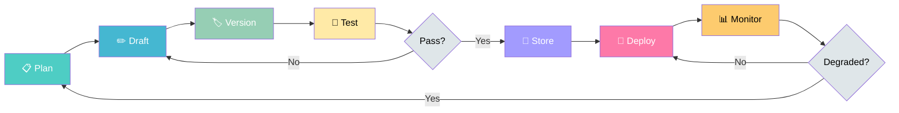

# Module 7: Prompt Management

**Treat prompts like production code — version them, test them, evaluate them, and deploy them with the same rigor you apply to any software artifact.**

---

## Why This Matters for an AI Engineer 🟡

A prompt that works today but can't be reproduced tomorrow is a liability, not an asset. In production LLM systems, prompts are not one-off text strings — they are **critical configuration** that determines output quality, cost, latency, and safety. Yet most teams manage prompts as scattered notes in Notion docs, Slack messages, or commented code blocks.

The consequences are predictable:

- **No reproducibility**: "Which prompt version produced that output?" — nobody knows.
- **No regression detection**: A prompt tweak that improves accuracy on one task silently breaks three others.
- **No cost visibility**: Token usage and API costs are invisible until the bill arrives.
- **No team collaboration**: Five engineers edit the same prompt in five different places, creating conflicting versions.

Prompt management treats prompts as first-class artifacts with a lifecycle: plan → draft → version → test → store → deploy → monitor. This module covers that lifecycle end-to-end, introduces a concrete tool (Promptmetheus) for the drafting and versioning phases, and demonstrates automated evaluation using DeepEval.

---

## 1. Prompt Management Lifecycle 🟢

The prompt management lifecycle is the structured process a prompt goes through from initial conception to retirement. Unlike ad-hoc prompt writing, this lifecycle enforces traceability, quality gates, and continuous improvement.

### Why This Matters

Without a lifecycle, prompt engineering devolves into trial and error. You cannot answer basic questions: Which version is deployed? What test cases were run against it? Who approved the last change? When was it last evaluated? A lifecycle provides answers to all of these — and makes prompt changes auditable, reversible, and measurable.

### The Five Phases

| Phase | What Happens | Key Artifacts | Who's Involved |
|-------|-------------|---------------|----------------|
| **Planning** | Define the task, success criteria, constraints, and target model | Requirements doc, task specification | Product, engineering |
| **Drafting** | Write initial prompt variations, decompose into blocks | Draft prompts, block templates | Prompt engineers |
| **Versioning** | Assign version numbers, track changes, store in registry | Version history, changelog, metadata | Engineering, ops |
| **Testing** | Run against test datasets, measure quality metrics | Test results, metric scores, comparison reports | QA, engineering |
| **Storage** | Store approved prompts in a retrievable, access-controlled registry | Registry entries, deployment configs | Engineering, ops |

### Planning Phase 🟡

Before writing a single word of prompt, clarify:

1. **Task definition**: What exactly should the model do? (classification, generation, extraction, summarization)
2. **Success criteria**: How will you measure success? (accuracy > 90%, latency < 2s, cost < $0.01/call)
3. **Input/output contract**: What does the prompt receive? What format must the output be in?
4. **Constraints**: Token limits, provider restrictions, safety requirements, cost budgets
5. **Target model(s)**: Which model(s) will this run on? (affects parameter defaults and token budget)

**Anti-pattern**: Jumping straight to writing prompts without a task spec. This leads to prompts that work for one test case but fail in production.

### Drafting Phase 🟡

Drafting is where prompt engineering happens. The key insight from Promptmetheus and similar tools is **composition over monoliths** — don't write prompts as single walls of text. Instead, decompose them into semantic blocks:

| Block | Purpose | Example |
|-------|---------|---------|
| **Context** | Background information the model needs | "You are a customer support agent for Acme Corp..." |
| **Task** | What the model should do | "Classify the following customer message..." |
| **Instructions** | Rules and constraints for the task | "Use exactly one of these labels: billing, technical, general" |
| **Samples** | Few-shot examples demonstrating the pattern | Input/output pairs showing correct behavior |
| **Primer** | Role assignment or persona setting | "You are a senior technical writer..." |

Block-based composition enables:
- **Rapid iteration**: Change one block without rewriting the entire prompt
- **A/B testing**: Swap individual blocks and measure the impact
- **Reuse**: Share blocks (e.g., a "primer" block) across multiple prompts
- **Cost estimation**: Calculate token count per block before running

### Versioning Phase 🟢

Every prompt change gets a version. This is non-negotiable in production.

**Versioning scheme**: Use semantic versioning adapted for prompts:
- **Major** (v1 → v2): Task definition changed, output format changed, or significant behavior shift
- **Minor** (v1.0 → v1.1): Instruction refinement, new test case added, block reorganization
- **Patch** (v1.0.0 → v1.0.1): Typo fix, wording tweak, delimiter change

**What to track per version**:
- Version number and timestamp
- Author (who made the change)
- Change description (what changed and why)
- Test results (metrics before and after)
- Deployment status (draft, staging, production, retired)

**Storage**: A prompt registry (database, JSON file, or dedicated tool) stores all versions with metadata. The registry is the single source of truth — not scattered files, not shared documents.

### Testing Phase 🟡

Prompt testing answers: "Does this prompt version produce acceptable outputs across a representative set of inputs?"

**Two levels of testing**:

1. **Manual testing**: Run the prompt against 10-20 diverse inputs, visually inspect outputs. Fast but subjective and unrepeatable.

2. **Automated evaluation**: Use a framework like DeepEval to measure output quality against defined metrics. Slower to set up but repeatable, objective, and CI-compatible.

**Key metrics for prompt evaluation**:

| Metric | What It Measures | When to Use |
|--------|-----------------|-------------|
| **Answer Relevancy** | Does the output address the input? | Every prompt — baseline quality check |
| **Faithfulness** | Is the output grounded in provided context? | RAG pipelines, context-dependent tasks |
| **Hallucination** | Does the output contain fabricated information? | Factual generation, Q&A systems |
| **Correctness** | Does the output match the expected result? | Classification, extraction, structured output |
| **Coherence** | Is the output logically consistent and well-structured? | Long-form generation, summarization |

**Threshold setting**: Each metric needs a minimum threshold. A prompt version "passes" only if all metrics meet their thresholds. This is your quality gate.

### Storage Phase 🟢

Approved prompts go into a registry — a structured store with:
- **Content**: The prompt text (or block decomposition)
- **Metadata**: Version, author, timestamps, tags, provider compatibility
- **Configuration**: Temperature, max tokens, model preferences
- **Test history**: Previous evaluation results and metric scores
- **Deployment state**: draft → staging → production → retired

The registry enables:
- **Retrieval**: "Show me all prompts for the customer support use case"
- **Comparison**: "What changed between v1.2 and v1.3?"
- **Rollback**: "Revert to v1.2 — v1.3 has lower relevancy scores"
- **Access control**: "Only approved prompts can be deployed to production"

---

## 2. Promptmetheus: A Prompt Engineering IDE 🔴

Promptmetheus is a concrete implementation of the lifecycle phases — specifically the **drafting, versioning, and testing** phases. It's worth examining as a case study in how tooling makes the lifecycle practical.

### Block-Based Composition

Promptmetheus decomposes prompts into composable blocks, each serving a semantic role:

```
┌─────────────────────────────────────┐
│  Context Block                      │
│  "You are a support agent for..."   │
├─────────────────────────────────────┤
│  Task Block                         │
│  "Classify the customer message..." │
├─────────────────────────────────────┤
│  Instructions Block                 │
│  "Use exactly one label from..."    │
├─────────────────────────────────────┤
│  Samples Block (Few-shot)           │
│  Example 1: message → label         │
│  Example 2: message → label         │
├─────────────────────────────────────┤
│  Primer Block                       │
│  "Output as JSON with key 'label'"  │
└─────────────────────────────────────┘
```

Each block can be independently modified, A/B tested, and versioned. This is the difference between editing a 500-word monolith and swapping a single instruction block.

### Multi-Model Testing

Promptmetheus supports 150+ models across 15 providers (OpenAI, Anthropic, Google, Mistral, Cohere, Groq, DeepSeek, and more). This matters because:

- A prompt optimized for GPT-4 may underperform on Claude due to different tokenization and instruction-following behavior
- Cost/performance tradeoffs vary wildly across models
- Vendor lock-in is avoided when you can test the same prompt across providers

### Evaluation Framework

Promptmetheus includes built-in evaluators and dataset-driven testing:
- **Datasets**: Define test inputs with variables, run them against prompts
- **Evaluators**: Automatic quality checks (e.g., output must be valid JSON, label must be from approved set)
- **Ratings**: Manual quality ratings with statistical visualization
- **Cost estimation**: Per-block token cost calculation before running

### Limitations

Promptmetheus is a **development-phase** tool — it excels at creating, testing, and optimizing prompts, but:
- It is not a production deployment platform
- Live A/B testing in production is limited
- You bring your own API keys (BYOK) — no built-in key management
- Steep learning curve for non-technical users

The lesson: tooling covers specific lifecycle phases. You still need production monitoring, access control, and rollback mechanisms beyond what any IDE provides.

---

## 3. Evaluation with DeepEval 🟡

DeepEval is an open-source LLM evaluation framework that integrates with pytest. It provides research-backed metrics, synthetic data generation, and CI/CD compatibility — making automated prompt evaluation practical.

### Why DeepEval

| Feature | Benefit |
|---------|---------|
| **50+ metrics** | G-Eval, faithfulness, hallucination, relevancy, toxicity, and more |
| **pytest-native** | Run evals like unit tests — `deepeval test run test_eval.py` |
| **LLM-as-judge** | Metrics powered by an LLM evaluating another LLM's output |
| **Threshold-based** | Define pass/fail criteria per metric — automatic quality gates |
| **CI/CD compatible** | Block deployments when evaluation scores drop |
| **Model-agnostic** | Evaluate outputs from any LLM provider |

### Core Concepts

**LLMTestCase**: The unit of evaluation. Contains:
- `input`: The prompt or question sent to the LLM
- `actual_output`: What the LLM actually produced
- `expected_output`: What the correct answer should be (optional, metric-dependent)
- `context`: Ground truth context the answer should be based on (for RAG/faithfulness metrics)

**Metric**: An evaluation criterion with a threshold. DeepEval metrics fall into two categories:
- **Standard metrics** (AnswerRelevancyMetric, FaithfulnessMetric): Pre-built, research-backed
- **Custom metrics** (GEval): You define the evaluation criteria in natural language

**evaluate()**: The entry point that runs test cases against metrics and produces pass/fail results.

### Example: Evaluating Two Prompt Versions

```python
from deepeval import evaluate
from deepeval.test_case import LLMTestCase, SingleTurnParams
from deepeval.metrics import GEval, AnswerRelevancyMetric

# Define metrics
correctness = GEval(
    name="Correctness",
    criteria="Determine if the actual output matches the expected output in meaning.",
    evaluation_params=[SingleTurnParams.ACTUAL_OUTPUT, SingleTurnParams.EXPECTED_OUTPUT],
    threshold=0.7,
)

relevancy = AnswerRelevancyMetric(threshold=0.8)

# Test case for Prompt v1.0
test_v1 = LLMTestCase(
    input="Classify: 'My bill is wrong' →",
    actual_output="billing",
    expected_output="billing",
)

# Test case for Prompt v2.0
test_v2 = LLMTestCase(
    input="Classify: 'My bill is wrong' →",
    actual_output="This message is about a billing issue.",
    expected_output="billing",
)

# Evaluate both versions
evaluate(
    test_cases=[test_v1, test_v2],
    metrics=[correctness, relevancy],
)
```

This example reveals a real tradeoff: Prompt v2.0 produces a more verbose output that may score higher on relevancy but lower on correctness (the expected output is a single label, not a sentence). Evaluation metrics make these tradeoffs **visible and measurable** rather than subjective.

---

## 4. Lifecycle Flow Diagram



The lifecycle is a **closed loop** — monitoring feeds back into planning. When output quality degrades (detected by evaluation metrics or user reports), the cycle restarts: re-plan the task, draft a new version, test, and redeploy.

---

## 5. Before/After: Prompt Versioning in Practice 🟡

### Scenario: Customer Support Classification Prompt

A team has a prompt that classifies customer support messages into categories. It works initially, but over time:
- New message types appear that the prompt wasn't designed for
- Multiple engineers tweak the prompt independently
- Nobody knows which version is deployed
- Output quality varies unpredictably

### Before (No Management)

**State**: One prompt file, `prompt.txt`, edited by whoever needs to change it.

```
# prompt.txt (last modified: unknown)
Classify this customer message into one of these categories:
billing, technical, general, Returns the category name only.
```

**Problems**:
- No version history — last editor overwrote previous version
- No test cases — changes are validated by "looks good to me"
- No evaluation — quality is measured by user complaints after deployment
- No rollback — if the new version breaks, there's no way to go back
- No metadata — who wrote this? What model is it for? What's the expected accuracy?

### After (With Lifecycle)

**State**: Versioned prompt in a registry with evaluation history.

```
Registry Entry: support-classifier
├── v1.0 (2026-06-01, author: alice)
│   ├── Prompt: "Classify this customer message into one of these categories: billing, technical, general. Return the category name only."
│   ├── Metrics: accuracy=0.87, latency=0.3s
│   ├── Status: retired
│   └── Notes: Initial version, basic 3-category classifier
│
├── v1.1 (2026-06-15, author: bob)
│   ├── Prompt: Added "returns" and "shipping" categories
│   ├── Metrics: accuracy=0.91, latency=0.35s
│   ├── Status: retired
│   └── Notes: Added 2 categories based on support ticket analysis
│
└── v2.0 (2026-07-01, author: alice)
    ├── Prompt: Restructured with few-shot examples, JSON output format
    ├── Metrics: accuracy=0.94, latency=0.4s, cost=$0.003/call
    ├── Status: production
    └── Notes: Major rewrite — block-based composition, evaluated against 200 test cases
```

**Benefits**:
- Every change is traceable (who, when, why)
- Quality is measurable (metrics before and after each version)
- Rollback is instant (revert to v1.1 if v2.0 has issues)
- Deployment is controlled (only "approved" versions reach production)
- Cost is visible ($0.003/call × volume = predictable budget)

---

## 6. Notebooks & Projects

- **Interactive Notebook**: [notebook.ipynb](notebook.ipynb) — Walk through the prompt lifecycle: version a prompt, run A/B comparisons, and evaluate with DeepEval metrics
- **Mini-Project**: [mini-project/](mini-project/) — Build a PromptRegistry with automated DeepEval evaluation pipeline that produces a comparison report

---

## 7. Common Pitfalls 🟡

### Pitfall 1: Treating Prompts as Static Text

Once a prompt is "good enough," teams stop updating it. But LLM behavior changes with model updates, user patterns shift, and new edge cases emerge. A prompt that scored 0.95 accuracy six months ago may score 0.82 today after a model update.

**Fix**: Schedule regular prompt evaluations (weekly or monthly). Treat prompts like dependencies — they have versions, they degrade, they need maintenance.

### Pitfall 2: Evaluating Prompts on Too Few Test Cases

Running a prompt against 3-5 inputs and declaring it "working" is survivorship bias. The prompt works on the cases you thought to test — but production traffic includes inputs you never imagined.

**Fix**: Build a test dataset of at least 50-100 diverse inputs. Include edge cases, adversarial inputs, and real production examples. DeepEval's synthetic data generation can help bootstrap test datasets.

### Pitfall 3: Optimizing for One Metric at the Expense of Others

Maximizing accuracy while ignoring cost is a common trap. A prompt that achieves 99% accuracy but costs $0.50 per call may be economically unviable at scale, while a 95% accuracy prompt at $0.003 per call delivers better business value.

**Fix**: Define a multi-metric evaluation suite. Set minimum thresholds for each metric. Optimize for the combination that meets all thresholds at the lowest cost — not for any single metric.

### Pitfall 4: Skipping Version Control Because "It's Just Text"

"It's just a prompt" is the most expensive sentence in LLM engineering. Without version control, you cannot:
- Reproduce a specific output that a user reported
- Roll back a change that degraded quality
- Compare the impact of prompt modifications
- Audit who changed what and when

**Fix**: Use a prompt registry (even a simple JSON file with version history) from day one. The cost of setting up versioning is trivial compared to the cost of debugging unversioned prompts in production.

### Pitfall 5: Confusing Prompt Testing with Prompt Evaluation

Testing asks: "Does the output match the expected result?" (binary: pass/fail). Evaluation asks: "How good is the output across multiple quality dimensions?" (continuous: scores).

A prompt can pass all tests (correct label, correct format) but still produce low-quality output (verbose, unclear, or unhelpful). Testing catches bugs; evaluation catches quality issues.

**Fix**: Use both. Testing via automated test cases catches functional failures. Evaluation via metrics like relevancy, coherence, and faithfulness catches quality degradation that tests miss.

---

## Key Takeaways

1. Prompt management is not optional in production — it's the difference between a working demo and a reliable system.
2. The lifecycle (plan → draft → version → test → store → deploy → monitor) provides structure and traceability.
3. Block-based composition (as in Promptmetheus) makes prompts modular, testable, and maintainable.
4. DeepEval provides pytest-native, automated evaluation with research-backed metrics and threshold-based quality gates.
5. Version control, test datasets, and multi-metric evaluation are the three pillars of prompt quality management.

---

## Further Reading

- [DeepEval Documentation](https://deepeval.com/docs/getting-started) — Getting started, metrics reference, and CI/CD integration
- [DeepEval GitHub](https://github.com/confident-ai/deepeval) — Source code, examples, and community (16.7k+ stars)
- [Promptmetheus Documentation](https://docs.promptmetheus.com) — Block-based prompt composition, datasets, evaluators
- [Promptmetheus](https://promptmetheus.com) — The Prompt Engineering IDE
- [Anthropic's Context Engineering Guide](https://www.anthropic.com/engineering/effective-context-engineering-for-ai-agents) — How prompt engineering evolves into context engineering for agentic systems
